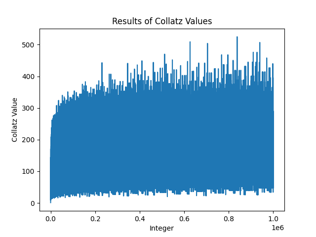

# Collatz-Sequence-Analyzer

[The Collatz conjecture](https://en.wikipedia.org/wiki/Collatz_conjecture) is a deceptively hard problem in mathematics. Let us define f(n) as follows: if n is even, then f(n) = n / 2; otherwise, f(n) = 3n + 1. What happens if we feed f(n) back into itself? Let us start with n = 5:
* f(5) = 3(5) + 1 = 16
* f(16) = 16 / 2 = 8
* f(8) = 8 / 2 = 4
* f(4) = 4 / 2 = 2
* f(2) = 2 / 2 = 1
* f(1) = 3(1) + 1 = 4

As we can see, if this sequence ever reaches 1, we enter a cycle. So we stop at f(2) = 1.

The Collatz Conjecture says that for any positive integer n, *the sequence generated by feeding f(n) back into itself will always reach 1.* While it seems simple on the surface, the Collatz Conjecture has never been proven (despite being over 80 years old).

I have written a simple Python script that calculates the Collatz sequence for some integer n and returns the length of that sequence. For example, the length of collatz(5) is 6. This script explores 3 values and how they change with respect to n: the total length of the Collatz sequence, the average length of the sequence, and the maximum length of the sequence. I tested this up to n = 1 million. My results are below. You are free to experiement with the script yourself.

